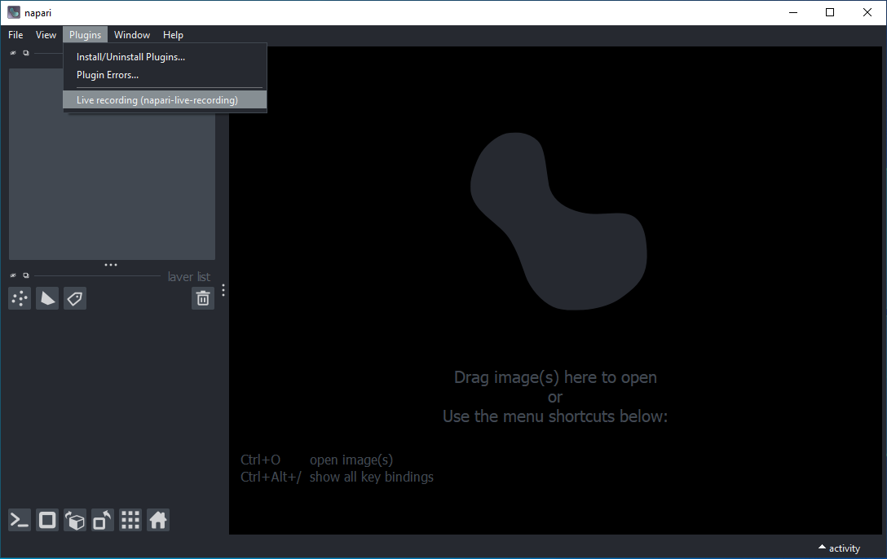
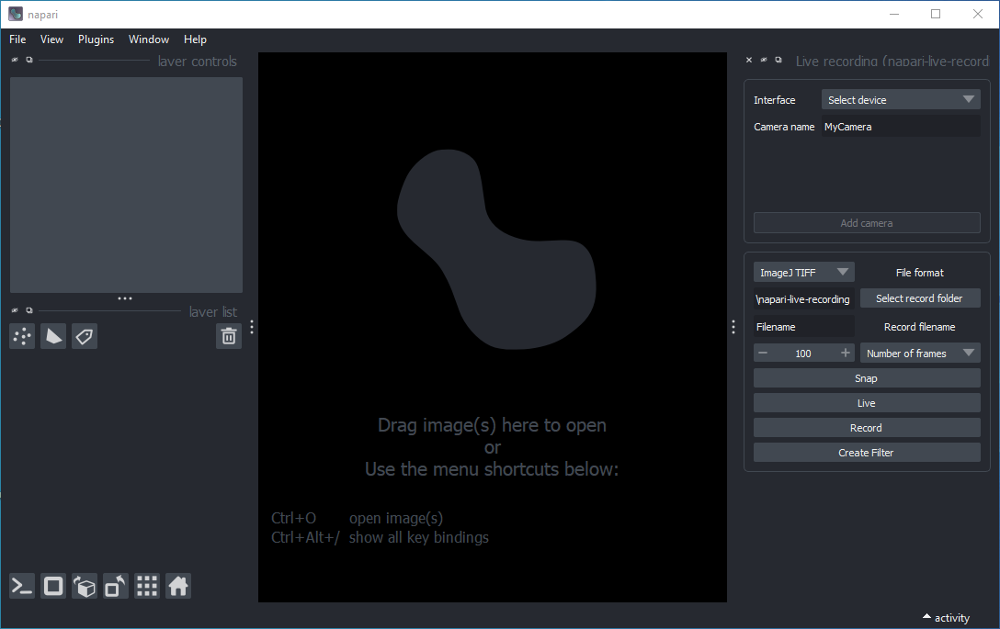
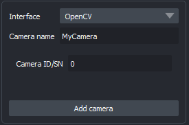
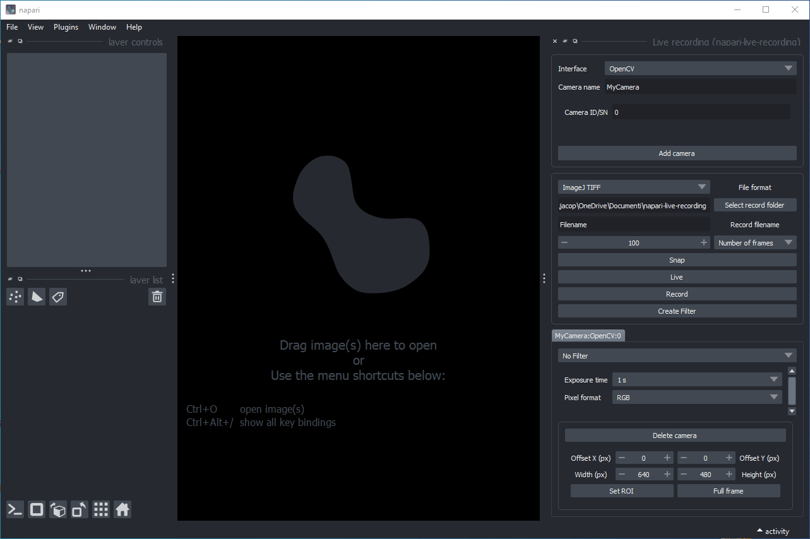

# napari-live-recording user guide

## Installation

You can install `napari-live-recording` via [pip]. It is reccomended to install `napari-live-recording` in a virtual environment. This can be do so via:

- [venv], for example:
    
        python -m venv nlr
        nlr\Scripts\activate
        pip install napari-live-recording

- [conda] or [mamba]

        mamba create -n nlr python=3.10 napari-live-recording

Alternatively, if you want to install the plugin using the source code, you can do so by cloning the project and installing locally:

    git clone https://github.com/jacopoabramo/napari-live-recording
    cd napari-live-recording
    pip install .

## Launching the plugin

In the same environment you installed the plugin, lunch napari with the command:

    napari

After napari is started, click on `Plugins > Live recording (napari-live-recording)`:

  

After a few seconds, the live recording widget will appear on the right side of napari:

  

The `Interface` widget allows you to chose the type of hardware interface to control. The `Camera name` widget allows you to customize the identifier associated with your camera. Multiple cameras can run at the same time, and are handled concurrently.

> [!NOTE]
> The Micro-Manager interface in the plugin was designed to handle only one camera. Developers did not test the occurance of generating two Micro-Manager cameras at the same time. For feedback please open an issue.

Each interface provides a way to select a specific hardware device. This can be an numeric identifier (ID) or serial number (SN). For example, selecting the OpenCV interface will look as below:

  

To add this OpenCV grabber, click on `Add camera`, adding the controls for your camera as shown below:

  

If you wish to remove the camera from the current list of devices, you can also click on `Delete camera` to remove it.

[venv]: https://docs.python.org/3/library/venv.html
[mamba]: https://mamba.readthedocs.io/en/latest/user_guide/mamba.html#mamba
[conda]: https://conda.io/projects/conda/en/latest/user-guide/tasks/manage-environments.html