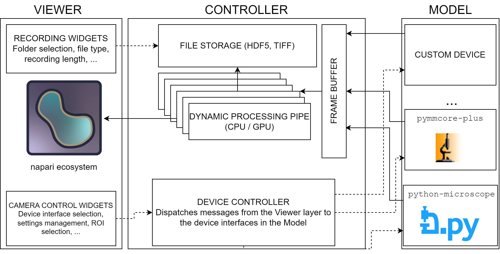

# Summary

napari-live-recording is a software plugin that combines real-time image capture, processing, and visualization with napari, a tool for multi-dimensional image viewing and annotation, enhancing its capabilities. It captures high-resolution images from various scientific cameras, streamlining image analysis tasks. Key features include real-time capture, an adaptable processing pipeline, live visualization, and video recording in TIFF and HDF5 formats, making so that acquired images can also exported and analyzed via Fiji as well. Designed for efficiency, this innovation simplifies complex workflows, making it accessible to researchers across diverse fields, accelerating discoveries, and fostering collaboration.

# Statement of need

Data acquisition and processing from high-resolution cameras are often separated into two different tasks. This is a direct effect on the incredible large portfolio offered by multiple manufacturers - each having its own design policy when it comes to control their devices. At the same time, manufacturers offer the possibility of interacting with their products via separated Software Development Kits (SDK). The language of choice for said SDKs is often C or C++, which are challenging languages that often require deep knowledge of computer architectures, whilst being particularly efficient. On the other hand, Python was originally designed to be more friendly towards both experienced programmers as well as newcomers, and thanks to the wide range of packages for scientific community has stedfastely grown as the prime choice for scientific computations. Moreover, Python is designed to interact with C/C++ code and libraries quite efficiently; not only that, manufacturers often provide also pre-built Python packages exposing their APIs (Application Programming Interfaces). In this context, napari-live-recording is capable of combining the two steps of acquisition and processing into a single workflow, regardless of the device used for acquiring data, bringing data analysis directly to the workbench.

# Architecture

The plugin follows the MVC (Model-Viewer-Controller) architectural pattern. A similar pattern has been presented in ImSwitch, called MVP (Model-Viewer-Presenter), as it allows to maintain high flexibility between different software layers without sacrificing performances.

* The **model** layer represents the backend of the plugin. It directly controls the camera device via an abstract, standardized interface; this allows to integrate controls for new devices seaminglessly, with no interfacing with the other layers whatsoever.

* The **viewer** layer represents the GUI (Graphical User Interface). It manages the interaction between the user and the software via means of widgets, graphical elements such as buttons and text editors; this layer directly interacts with napari to update layers with incoming captured images from camera devices.

* The **controller** layer is the "middle man" between the model and the viewer, and is in charge of dispatching request to the model according to the interactions that the user had with the viewer, managing and adapting the required data types depending on the incoming requests.

{width=80%}

